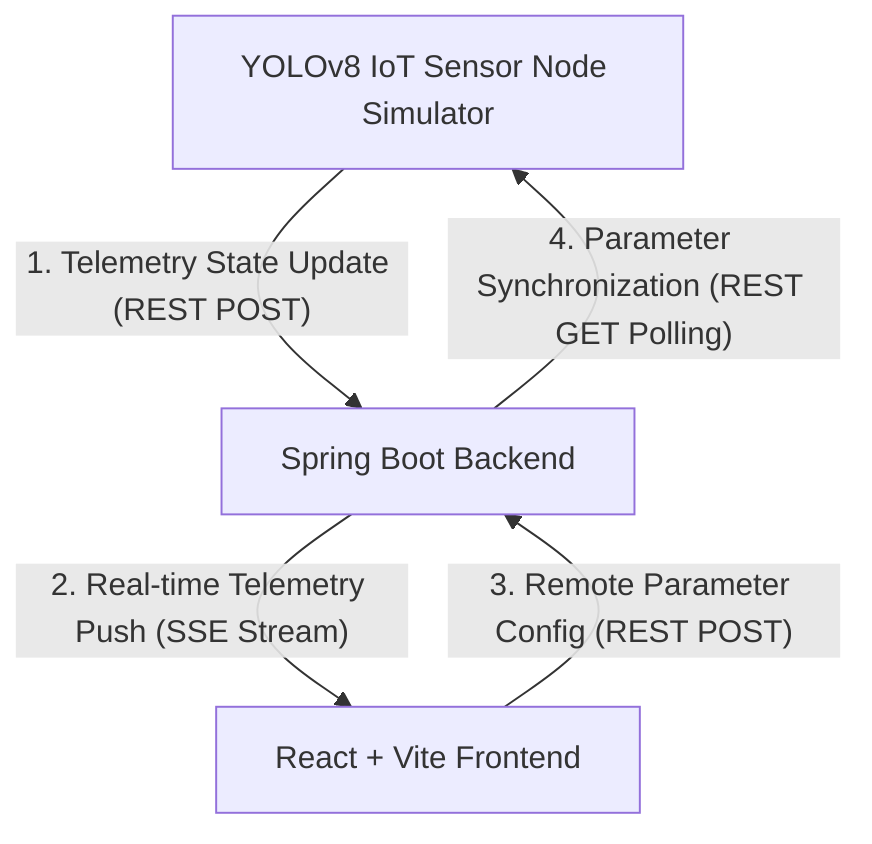

# 📡 AetherSpace IoT 좌석 제어 및 자동 반납 관제 시스템 (AetherSpace Occupancy & Auto-Release Control Dashboard)

AetherSpace는 AI 기반 실시간 IoT 물리 센서 데이터와 연동하여 오피스 내 좌석의 실시간 점유 상태를 효율적으로 관리하고, 장기 부재 좌석을 감지하여 자동으로 좌석을 반납 처리해주는 **개인정보 보호 최우선(Privacy-First) 지능형 관제 대시보드**입니다.

---

## 🔒 프로젝트 핵심 철학: Privacy-First & Zero Data Collection

본 시스템은 **"사용자의 어떠한 개인정보(이름, 사진, 사원번호 등)도 수집하지 않는다"**는 원칙 하에 설계되었습니다.
- 사용자와 단말기의 직접적인 매핑을 차단하고 오직 **좌석 고유 ID(예: S-01 ~ S-48)** 정보만을 기준으로 점유 현황 및 원격 반납을 관제합니다.
- 물리적 IoT 감지 노드(YOLOv8 센서)는 단순 좌석 점유 여부('empty' | 'occupied' | 'away') 및 타이머 정보만을 수집 및 가공하여 전송합니다.

---

## ✨ 핵심 제공 기능

1. **실시간 좌석 모니터링 (Monitoring View)**
   - 48개 좌석의 실시간 이용 가능(AVAILABLE), 사용 중(OCCUPIED), 자리 비움(AWAY) 상태를 한눈에 모니터링할 수 있는 프리미엄 다크 모드 좌석 배치도(Map Grid)를 제공합니다.
   - 자리비움(AWAY) 상태의 좌석은 반납 대기 시간 카운트다운을 시각적으로 실시간 표현하며, 관리자 권한을 통한 수동 강제 제어도 지원합니다.

2. **장기 부재 좌석 자동 반납 이력 (Auto-Return History / Analytics View)**
   - 개인정보 비노출 원칙에 맞추어 좌석 ID, 마지막 움직임 감지 시간, 자리비움 타이머 경과율, 조치 사항(좌석 자동 해제 완료, 반납 유예 알림 등)의 실시간 이력 정보를 깔끔한 화면 전체 너비 테이블로 기재합니다.
   - 다음 FSM(Finite State Machine) 스캔 잔여시간 및 시스템 반응성/신뢰성 지표 카드를 지원합니다.

3. **감지 & 반납 제어 콘솔 (Configuration View)**
   - **자동 반납 대기 시간 (Away Timeout)**: 좌석에 움직임이 없을 때 강제 자동 반납으로 넘어가기 전까지의 허용 시간(5분 ~ 30분)을 슬라이더로 조절합니다.
   - **IoT 센서 감지 감도 (Sensitivity)**: 낮음, 보통, 높음 단계별 미세 감도 설정을 원격으로 조작하여 오감지를 필터링합니다.
   - 설정 저장 시, 백엔드 데이터베이스에 즉시 동기화되어 가동 중인 실시간 임베디드 시뮬레이터(디바이스) 노드에 즉시 배포됩니다.

---

## 🛠️ 기술 스택 및 아키텍처

### System Flow Diagram


- **Frontend**: `React 19`, `Vite 6`, `TypeScript`, `Tailwind CSS`, `Lucide React Icons`
  - 디자인 시스템: 프리미엄 다크 글래스모피즘(Glassmorphism), 미세 마이크로 애니메이션
- **Backend**: `Spring Boot 3.4.2` (Java 21)
  - `Server-Sent Events (SSE)`를 활용하여 클라이언트에 딜레이 없는 초경량 실시간 데이터 동기화 파이프라인 구축 (기본 Port: `8080`)
- **IoT Simulator**: `Python 3.14`
  - YOLOv8 물리 센서를 에뮬레이팅하여 48개 노드의 상태 전송 및 원격 임계 설정 실시간 자동 동기화 시뮬레이터 구동

---

## 🚀 로컬 구동 방법

원활한 구동을 위해 다음 순서로 각 서버 및 프로세스를 시작하십시오.

### 1단계: Spring Boot 백엔드 서버 시작
```bash
cd backend
./gradlew bootRun
```
- 서버가 정상 구동되면 `http://localhost:8080` 포트에서 가동되며, REST API 엔드포인트 및 실시간 SSE 스트림(`/api/seats/stream`)이 활성화됩니다.

### 2단계: React 프론트엔드 서버 구동
프로젝트 루트 디렉토리에서 아래 명령어를 실행하십시오.
```bash
npm install
npm run dev
```
- 로컬 웹서버가 가동되며 **[http://localhost:3000](http://localhost:3000)**을 통해 미려한 관제 대시보드에 즉시 접속할 수 있습니다.

### 3단계: 임베디드 YOLOv8 센서 노드 시뮬레이터 실행
프로젝트 루트 디렉토리에서 시뮬레이터를 구동하여 실시간 모니터링 가상 데이터를 주입합니다.
```bash
python3 -u mock_iot_node.py
```
- 시뮬레이터가 구동되면 백엔드 설정 값(Away Timeout)을 3초 이내에 자동 동기화하며, 각 좌석 노드의 상태 변화를 주기적으로 텔레메트리 전송하기 시작합니다.
