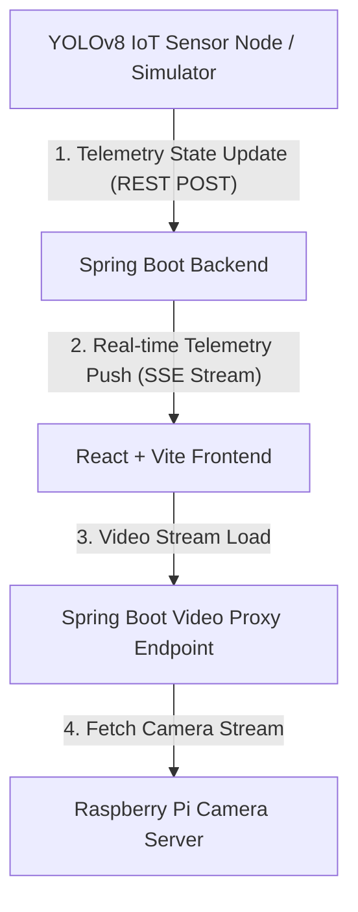

# 📡 AetherSpace IoT 좌석 제어 및 자동 반납 관제 시스템 (AetherSpace Occupancy & Auto-Release Control Dashboard)

AetherSpace는 AI 기반 실시간 IoT 물리 센서 데이터와 연동하여 오피스 내 좌석의 실시간 점유 상태를 효율적으로 관리하고, 장기 부재 좌석을 감지하여 자동으로 좌석을 반납 처리해주는 **개인정보 보호 최우선(Privacy-First) 지능형 관제 대시보드**입니다.

---

## 🔒 프로젝트 핵심 철학: Privacy-First & Zero Data Collection

본 시스템은 **"사용자의 어떠한 개인정보(이름, 사진, 사원번호 등)도 수집하지 않는다"**는 원칙 하에 설계되었습니다.
- 사용자와 단말기의 직접적인 매핑을 차단하고 오직 **좌석 고유 ID(예: S-01, S-02, S-03)** 정보만을 기준으로 점유 현황 및 원격 반납을 관제합니다.
- 물리적 IoT 감지 노드(YOLOv8 센서)는 단순 좌석 점유 여부(`empty` | `occupied` | `away`) 및 타이머 정보만을 수집 및 가공하여 전송합니다.

---

## ✨ 핵심 제공 기능

1. **실시간 좌석 모니터링 (Monitoring View - 좌우 2분할 레이아웃)**
   - 대시보드를 현대적인 **좌/우 2분할 구조(비디오 5 : 좌석 배치도 7)**로 구성합니다:
     - **좌측 (실시간 CCTV 피드)**: 라즈베리파이 카메라가 전송하는 영상을 스프링 부트 프록시 파이프라인을 거쳐 CORS 및 mixed content(HTTP/HTTPS) 제한 없이 브라우저에 안전하게 출력합니다. 재생/일시정지 기능 및 브라우저 캐시 무력화 새로고침 기능을 내장하고 있습니다.
     - **우측 (좌석 배치도)**: 감지 노드와 동기화된 실시간 좌석 AVAILABLE(이용 가능), OCCUPIED(사용 중), AWAY(자리비움) 점유 상태를 렌더링하며, 관리자의 강제 제어 기능과 타이머 카운트다운을 표시합니다.
   
2. **실시간 기기 오프라인 감지 및 자동 화면 비움 (Telemetry Timeout)**
   - 라즈베리파이 센서 또는 시뮬레이터 프로그램이 비정상 종료되거나 연결이 유실되어 **12초간 데이터 수신이 없을 경우**, 백엔드 메모리 캐시를 즉시 비우고 브라우저로 리셋 신호를 송출합니다.
   - 대시보드는 실존하지 않는 가짜/이전 데이터를 격리하기 위해 좌석 배치도를 숨기고 **"라즈베리파이 센서 데이터 연결 대기 중..."** 점멸 대기 화면으로 자동 전환됩니다.

3. **장기 부재 좌석 자동 반납 이력 (Analytics View)**
   - 자동 반납 처리된 좌석의 실시간 로그 이력 테이블(대상 좌석 ID, 마지막 움직임 감지 시간, 경과 비율, 조치 액션 등)을 투명하게 제공합니다.

4. **라즈베리파이 카메라 스트리밍 설정 (Configuration View)**
   - 라즈베리파이 카메라가 비디오를 퍼블리싱하는 영상 주소(`streamUrl`)를 웹 대시보드에서 원격으로 입력 및 동기화할 수 있습니다. 저장 즉시 실시간 관제 화면의 프록시 스트리밍 소스가 자동 갱신됩니다.
   - 사용성 극대화 및 깔끔한 제어를 위해, 복잡한 ROI 좌표 설정, 구역별 클러스터 설정 및 불필요한 슬라이더(부재 대기 시간, 감도 설정)는 설정 화면에서 제거되어 오직 카메라 연결 스트림에 집중하여 쾌적한 설정 관리가 가능합니다.

---

## 🛠️ 기술 스택 및 아키텍처

### System Flow Diagram


- **Frontend**: `React 19`, `Vite 6`, `TypeScript`, `Tailwind CSS`, `Lucide React Icons`
  - 디자인 시스템: 프리미엄 다크 글래스모피즘(Glassmorphism), 미세 마이크로 애니메이션
- **Backend**: `Spring Boot 3.4.2` (Java 21)
  - `Server-Sent Events (SSE)`를 활용하여 클라이언트에 딜레이 없는 초경량 실시간 데이터 동기화 파이프라인 구축 (기본 Port: `8080`)
  - 라즈베리파이 로컬 MJPEG 영상 스트림의 CORS 우회 중계를 위한 비디오 프록시 구현 (`GET /api/admin/config/video-stream`)
  - 12초간의 데이터 단절 시 메모리 캐시를 즉시 정리하고 클라이언트에 갱신 데이터를 브로드캐스팅하는 실시간 오프라인 스케줄러 구현
- **IoT Simulator**: `Python 3.14` (`mock_iot_node.py`)
  - YOLOv8 물리 센서를 에뮬레이팅하여 S-01 ~ S-03 노드의 상태를 3초 주기로 백엔드에 텔레메트리 전송
- **Raspberry Pi Camera Server**: `Python 3` + `Flask` + `OpenCV` (`stream_server.py`)
  - 카메라 모듈에서 영상을 받아 MJPEG 표준 규격으로 실시간 송출하는 웹서버 구동 (CORS 지원)

---

## 🚀 로컬 구동 방법

원활한 구동을 위해 다음 순서로 각 서버 및 프로세스를 시작하십시오.

### 1단계: Spring Boot 백엔드 서버 시작
```bash
cd backend
./gradlew bootRun
```
- 서버가 정상 구동되면 `http://localhost:8080` 포트에서 가동되며, REST API 엔드포인트 및 실시간 SSE 스트림(`/api/seats/stream`)이 활성화됩니다.

### 2단계: React 프론트엔드 서버 구동
프로젝트 루트 디렉토리에서 아래 명령어를 실행하십시오.
```bash
npm install
npm run dev
```
- 로컬 웹서버가 가동되며 **[http://localhost:3000](http://localhost:3000)**을 통해 미려한 관제 대시보드에 즉시 접속할 수 있습니다.

### 3단계 (택일 A): 라즈베리파이 Flask 비디오 스트리밍 서버 가동 (실제 장비 연결 시)
라즈베리파이 터미널에서 Flask 패키지를 설치한 후 아래 코드를 구동합니다.
```bash
pip install flask flask-cors opencv-python
python3 stream_server.py
```
- 주소 `http://[라즈베리파이IP]:5000/video_feed`를 웹 대시보드 설정 페이지에 등록하면 관제판에 실시간 비디오가 연동됩니다.

### 3단계 (택일 B): 임베디드 YOLOv8 센서 노드 시뮬레이터 실행 (가상 데이터 테스트 시)
프로젝트 루트 디렉토리에서 시뮬레이터를 구동하여 실시간 모니터링 가상 데이터를 주입합니다.
```bash
python3 -u mock_iot_node.py
```
- 시뮬레이터가 가동되면 S-01 ~ S-03 좌석 노드의 상태 변화(`empty` ➡️ `occupied` ➡️ `away`)를 3초 간격으로 백엔드 서버에 지속적으로 송신합니다.
- 시뮬레이터 작동을 멈추면 **12초 타임아웃**이 동작하여 백엔드 캐시가 리셋되고 웹페이지가 대기 상태로 진입하는 것을 확인할 수 있습니다.
