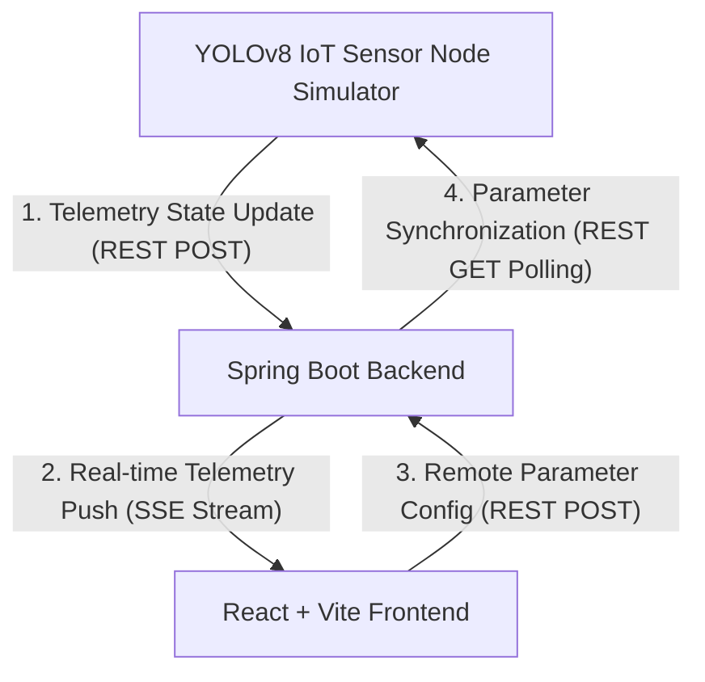

# 📡 AetherSpace IoT 좌석 제어 및 자동 반납 관제 시스템 (AetherSpace Occupancy & Auto-Release Control Dashboard)

AetherSpace는 AI 기반 실시간 IoT 물리 센서 데이터와 연동하여 오피스 내 좌석의 실시간 점유 상태를 효율적으로 관리하고, 장기 부재 좌석을 감지하여 자동으로 좌석을 반납 처리해주는 **개인정보 보호 최우선(Privacy-First) 지능형 관제 대시보드**입니다.

---

## 🔒 프로젝트 핵심 철학: Privacy-First & Zero Data Collection

본 시스템은 **"사용자의 어떠한 개인정보(이름, 사진, 사원번호 등)도 수집하지 않는다"**는 원칙 하에 설계되었습니다.
- 사용자와 단말기의 직접적인 매핑을 차단하고 오직 **좌석 고유 ID(예: S-01 ~ S-48)** 정보만을 기준으로 점유 현황 및 원격 반납을 관제합니다.
- 물리적 IoT 감지 노드(YOLOv8 센서)는 단순 좌석 점유 여부('empty' | 'occupied' | 'away') 및 타이머 정보만을 수집 및 가공하여 전송합니다.

---

## ✨ 핵심 제공 기능

1. **실시간 좌석 모니터링 (Monitoring View)**
   - 48개 좌석의 실시간 이용 가능(AVAILABLE), 사용 중(OCCUPIED), 자리 비움(AWAY) 상태를 한눈에 모니터링할 수 있는 프리미엄 다크 모드 좌석 배치도(Map Grid)를 제공합니다.
   - 자리비움(AWAY) 상태의 좌석은 반납 대기 시간 카운트다운을 시각적으로 실시간 표현하며, 관리자 권한을 통한 수동 강제 제어도 지원합니다.

2. **장기 부재 좌석 자동 반납 이력 (Auto-Return History / Analytics View)**
   - 개인정보 비노출 원칙에 맞추어 좌석 ID, 마지막 움직임 감지 시간, 자리비움 타이머 경과율, 조치 사항(좌석 자동 해제 완료, 반납 유예 알림 등)의 실시간 이력 정보를 깔끔한 화면 전체 너비 테이블로 기재합니다.
   - 다음 FSM(Finite State Machine) 스캔 잔여시간 및 시스템 반응성/신뢰성 지표 카드를 지원합니다.

3. **감지 & 반납 제어 콘솔 (Configuration View)**
   - **자동 반납 대기 시간 (Away Timeout)**: 좌석에 움직임이 없을 때 강제 자동 반납으로 넘어가기 전까지의 허용 시간(5분 ~ 30분)을 슬라이더로 조절합니다.
   - **IoT 센서 감지 감도 (Sensitivity)**: 낮음, 보통, 높음 단계별 미세 감도 설정을 원격으로 조작하여 오감지를 필터링합니다.
   - 설정 저장 시, 백엔드 데이터베이스에 즉시 동기화되어 가동 중인 실시간 임베디드 시뮬레이터(디바이스) 노드에 즉시 배포됩니다.

---

## 🛠️ 기술 스택 및 아키텍처

### System Flow Diagram


- **Frontend**: `React 19`, `Vite 6`, `TypeScript`, `Tailwind CSS`, `Lucide React Icons`
  - 디자인 시스템: 프리미엄 다크 글래스모피즘(Glassmorphism), 미세 마이크로 애니메이션
- **Backend**: `Spring Boot 3.4.2` (Java 21)
  - `Server-Sent Events (SSE)`를 활용하여 클라이언트에 딜레이 없는 초경량 실시간 데이터 동기화 파이프라인 구축 (기본 Port: `8080`)
- **IoT Simulator**: `Python 3.14`
  - YOLOv8 물리 센서를 에뮬레이팅하여 48개 노드의 상태 전송 및 원격 임계 설정 실시간 자동 동기화 시뮬레이터 구동

---

## 🚀 로컬 구동 방법

원활한 구동을 위해 다음 순서로 각 서버 및 프로세스를 시작하십시오.

### 1단계: Spring Boot 백엔드 서버 시작
```bash
cd backend
./gradlew bootRun
```
- 서버가 정상 구동되면 `http://localhost:8080` 포트에서 가동되며, REST API 엔드포인트 및 실시간 SSE 스트림(`/api/seats/stream`)이 활성화됩니다.

### 2단계: React 프론트엔드 서버 구동
프로젝트 루트 디렉토리에서 아래 명령어를 실행하십시오.
```bash
npm install
npm run dev
```
- 로컬 웹서버가 가동되며 **[http://localhost:3000](http://localhost:3000)**을 통해 미려한 관제 대시보드에 즉시 접속할 수 있습니다.

### 3단계: 임베디드 YOLOv8 센서 노드 시뮬레이터 실행
프로젝트 루트 디렉토리에서 시뮬레이터를 구동하여 실시간 모니터링 가상 데이터를 주입합니다.
```bash
python3 -u mock_iot_node.py
```
- 시뮬레이터가 구동되면 백엔드 설정 값(Away Timeout)을 3초 이내에 자동 동기화하며, 각 좌석 노드의 상태 변화를 주기적으로 텔레메트리 전송하기 시작합니다.
=======
# 🌐 지능형 공간 점유 실시간 관제 시스템 (iot-web-dashboard)

> **YOLOv8 엣지 인공지능 기반 관심구역(ROI) 스캔 및 유한 상태 머신(FSM) 알고리즘**을 활용한 실시간 세미나실 좌석 점유 관제 포털 풀스택 시스템입니다. 본 시스템은 고유한 미래지향적 심해 테마 가이드인 **Obsidian Orbit** 설계 표준을 준수합니다.

---

## 🖥️ 프로젝트 개요 및 핵심 아키텍처

본 시스템은 단일 페이지(SPA)의 한계를 탈피하고, 다중 페이지 아키텍처(Multi-Page Architecture) 기반으로 일반 이용자와 관리자 권한을 완벽히 격리하여 설계되었습니다. 라즈베리 파이 4 임베디드 단말 노드의 엣지 추론 결과 수신과 프론트엔드 React 관제 웹 포털로의 실시간 푸시를 연계하는 고속 인메모리(In-Memory) 웹 파이프라인을 구축했습니다.

### 🛰️ 데이터 파이프라인 (Data Pipeline Flow)
* **라즈베리파이 4 (YOLOv8 + FSM 엣지 런타임)** ➡️ *HTTP POST (실시간 상태 전이 데이터 전송)* ➡️ **Spring Boot 코어 백엔드** ➡️ *SSE (Server-Sent Events 단방향 푸시 스트림)* ➡️ **React 관제 포털 웹 (AetherSpace Core)**

---

## 📂 프로젝트 파일 및 디렉토리 구조 (Directory Structure)

### 🔵 프론트엔드 (React + Vite)
- src/assets/: 배경 텍스처 등 정적 자원 관리 (stardust.png)
- src/components/: 공통 레이아웃 컴포넌트 조각 (Navigation)
- src/pages/MainMonitoring.jsx: [페이지 1] 실시간 원형 서킷 관제 대시보드
- src/pages/SpatialAnalytics.jsx: [페이지 2] 공간 자원 이용 통계 및 시각화 그래프
- src/pages/AdminConfig.jsx: [페이지 3] AI 엣지 원격 설정 및 ROI 캘리브레이션
- src/pages/AdminLogin.jsx: [페이지 4] 중앙 관제 네트워크 관리자 인증 창
- src/styles/: 전역 스타일시트 (Tailwind CSS 지시어 적용)
- src/App.jsx: react-router-dom 기반 전체 스위칭 라우터 엔트리

### 🟢 백엔드 (Spring Boot + Gradle)
- src/main/java/com/example/dashboard/config/WebConfig.java: 전역 크로스 오리진 (CORS Policy) 전면 보안 허용 설정
- src/main/java/com/example/dashboard/dto/SeatUpdateDto.java: 임베디드 - 백엔드 - 프론트엔드 통합 데이터 교환 표준 규격
- src/main/java/com/example/dashboard/controller/SeatController.java: 인메모리 ConcurrentHashMap 데이터 캐시 및 SSE 스트림 시그널 센터

---

## ✨ 핵심 기능 명세 (Key Features)

### 1. 실시간 원형 서킷 관제 대시보드 (`/`)
* **방사형 GUI 매핑:** 기존의 딱딱한 사각형 그리드를 배제하고, 중앙의 거대한 메인 원형 게이지를 중심으로 4개의 관제 구역(Zone) 노드가 호(Circular Arc)를 그리며 감싸는 테크니컬 디자인 레이아웃을 구현했습니다.
* **SVG 동적 게이지:** 상태 변화에 따라 전체 세미나실의 이용률이 수학적 메커니즘을 통해 실시간 스케일 애니메이션으로 게이지 바에 동적 반영됩니다.
* **FSM 타이머 오버레이:** 특정 구역이 일시 부재(Away) 상태로 전이되면, 링 측면 카드 내부에 노란색 인디케이터 칩이 활성화되며 1초 단위로 줄어드는 카운트다운 타이머가 동적 바인딩됩니다.
* **통합 시뮬레이터 내장:** 백엔드가 부재한 환경에서도 단독 테스트가 가능하도록 가상 패킷 스트리밍 모드를 탑재하여 프론트 단독 데모 발표 안정성을 확보했습니다.

### 📊 2. 공간 자원 데이터 분석 통계 (`/analytics`)
* **혼잡도 트렌드 분석:** 요일별/시간대별 실제 밀집도 수치를 선형 그래프로 시각화하여 공간 과밀화 주의 단계를 추적합니다.
* **구역별 회전율 통계:** 도넛 차트(Donut Chart) 기반 자원 활용 계수를 수치화하여 자원 활용의 불균형을 분석합니다.
* **비정상 독점 조치 리포트:** 장기 자리비움 유예 제한 시간을 초과하여 FSM 알고리즘이 개입한 가용성 회수 이력을 정밀 테이블 구조로 정제해 냅니다.

### ⚙️ 3. AI 엣지 원격 설정 및 캘리브레이션 (`/admin`)
* **ROI 가상 바운딩 툴:** 64-bit 비전 좌표 분석을 기반으로 가상의 좌석 검출 구역 앵커링 시뮬레이션을 구현했습니다.
* **원격 파라미터 제어:** 부재 허용 임계 시간 및 YOLOv8 관심구역 프레임 누적 필터링 감도 변수를 웹 UI 상에서 슬라이더 조작을 통해 백엔드로 즉시 갱신 전송할 수 있는 패널을 지원합니다.

### 🔐 4. 시스템 라우팅 보안 가이드 (`/login`)
* **라우터 가드 오버레이:** 인가되지 않은 외부 세션이 관리자 전용 제어 구역에 접근 시, 자바스크립트 스코프 단에서 인터셉트하여 경고 알림 모달을 띄우고 기본 로그인 관문으로 강제 격리하는 보안 체계를 구축했습니다.

---

## 🛠️ 개발 환경 구축 및 가동 방법 (Getting Started)

### 1. 프론트엔드 종속성 설치 및 가동
$cd iot-web-dashboard$ npm install react-router-dom lucide-react recharts
$ npm run dev
> 터미널에 초록색 주소가 표출되면 브라우저에서 http://localhost:5173/ 에 접속합니다.

### 2. 백엔드 Spring Boot 구동
1. IDE(IntelliJ 등)를 활용하여 프로젝트 오픈 후 빌드 환경을 설정합니다.
2. com.example.dashboard.DashboardApplication 컨텍스트 로더 엔트리를 실행하여 서버를 가동합니다. (기본 Port: 8080)

---
© 2026 AETHERSPACE SYSTEM CORE. 모든 제어 권한 보호됨.
